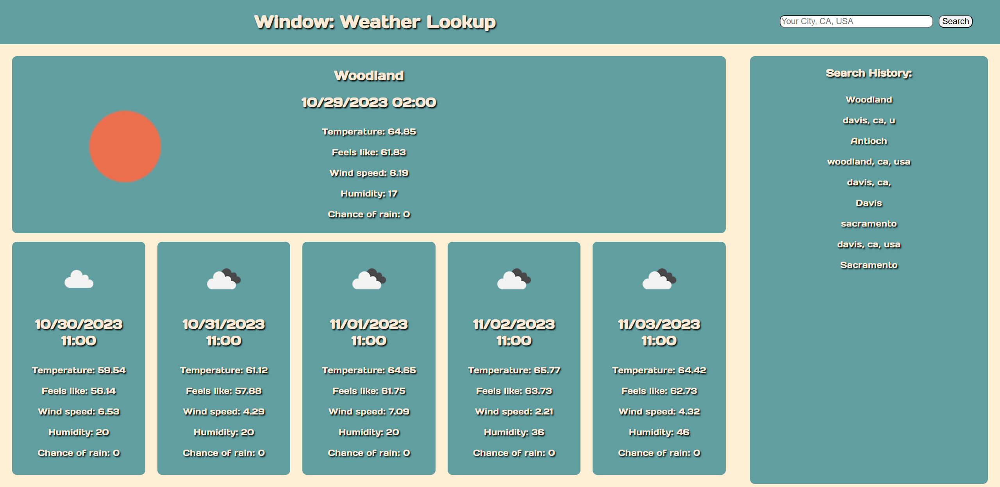

# ucdbc-challenge-6

# Description

This is a simple weather app made for a class project. With it, you can see your current, and future weather up to five days in advance.

# Usage

To find your weather, simply use the search bar in the top right corner, inputting your city, state, and country. Alternatively, you may also input just your city, however you may not recieve accurate results this way. Once you've hit search, the boxes on the left side of the sceen will populate with your current weather, and a five day forecast. On the right side of the screen is your search history, which persists between sessions, where you can click on any previously searched location to quickly get back to it's forecast. When leaving and reloading the page, it will automatically load the last made search.

# Credits

This web application uses:

OpenWeatherAPI: https://openweathermap.org/
DayJS: https://day.js.org/
And the "Days One" font available on google fonts: https://fonts.google.com/specimen/Days+One?query=days+one

# Link to application

https://bearlyfunctional.github.io/ucdbc-challenge-6/

